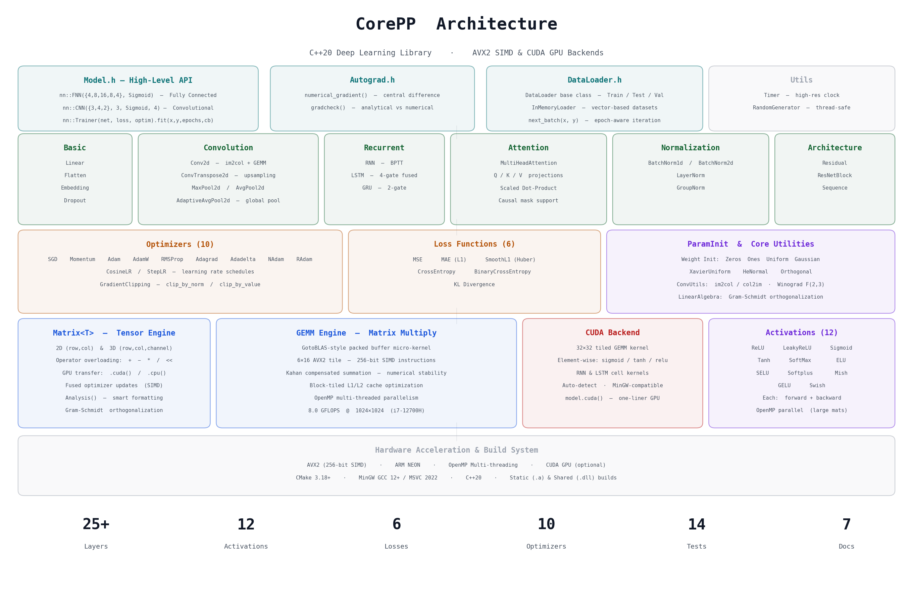
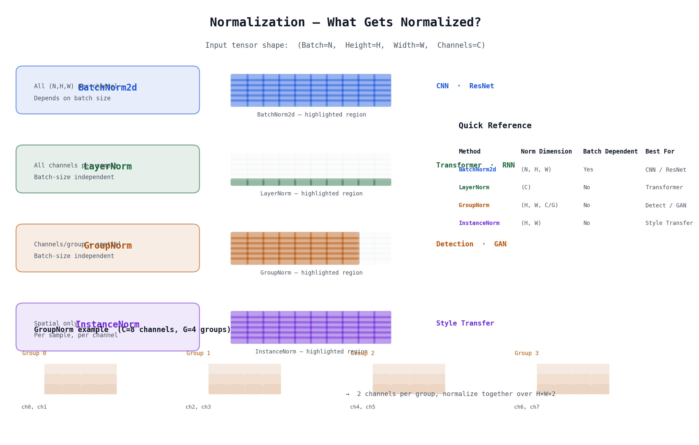
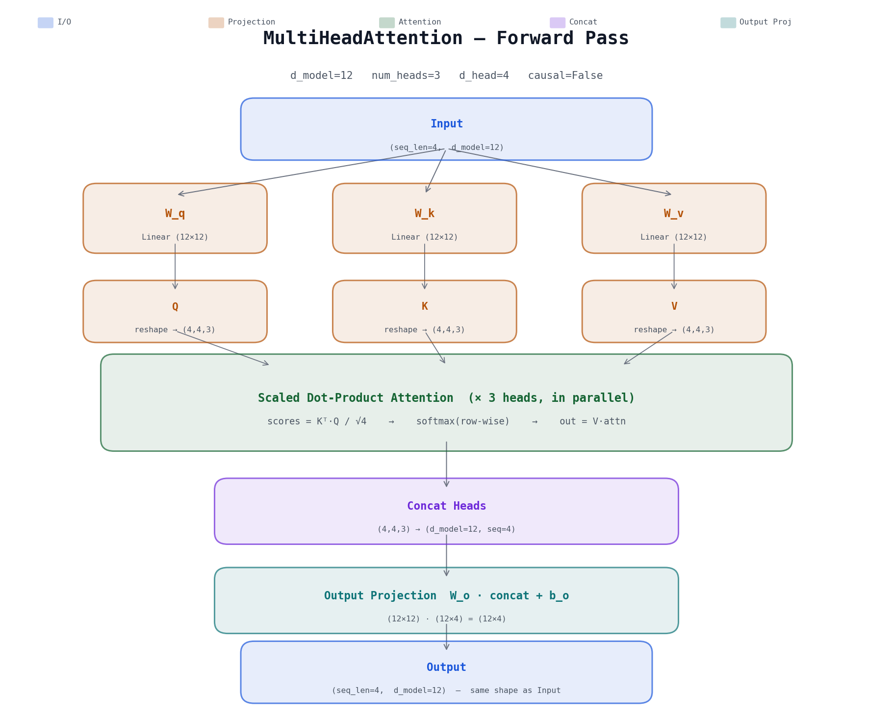
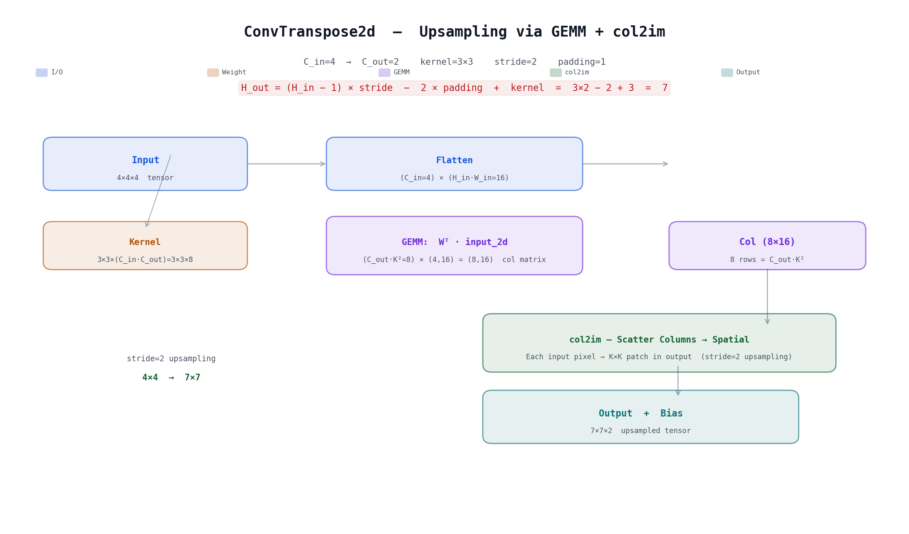

<p align="center">
  
</p>

---

<p align="center">
  <strong>CorePP</strong> — A pure C++20 deep learning library with AVX2 SIMD &amp; CUDA GPU backends.
</p>

<p align="center">
  
  
  
  
  
  
</p>

---

## :zap: Highlights

| Category | Count | Items |
|:---------|:-----:|:------|
| Layers | **25+** | `Linear` `Conv2d` `ConvTranspose2d` `MaxPool2d` `AvgPool2d` `AdaptiveAvgPool2d` `Flatten` `RNN` `LSTM` `GRU` `BatchNorm1d` `BatchNorm2d` `LayerNorm` `GroupNorm` `Dropout` `Embedding` `MultiHeadAttention` `Residual` `ResNetBlock` |
| Activations | **12** | `ReLU` `LeakyReLU` `Sigmoid` `Tanh` `SoftMax` `ELU` `SELU` `Softplus` `Mish` `GELU` `Swish` |
| Losses | **6** | `MSE` `MAE` `SmoothL1` `CrossEntropy` `BCE` `KL Divergence` |
| Optimizers | **10** | `SGD` `Momentum` `Adam` `AdamW` `RMSProp` `Adagrad` `Adadelta` `NAdam` `RAdam` + `CosineLR` `StepLR` |
| Utilities | — | `GradientClipping` · `DataLoader` · `numerical_gradient` · `gradcheck` |

### :art: Normalization Family

<p align="center">
  
</p>

### :brain: Transformer Attention

<p align="center">
  
</p>

### :arrow_up: Convolutional Upsampling

<p align="center">
  
</p>

---

## :rocket: Quick Start

```cpp
#include "CorePP.h"
using namespace CoreNNSpace;

int main() {
    // One-liner network:  4 → 8 → 16 → 8 → 4
    auto net = nn::FNN({4, 8, 16, 8, 4}, nn::Sigmoid);

    Matrix<float> x(4, 1); x << 3 << 4 << 2 << 1;
    Matrix<float> y(4, 1); y << 1 << 0 << 0 << 0;

    nn::Trainer(net, nn::MSE, Optim(net.getParams(), Adam, 0.01f))
        .fit(x, y, 300, [](int e, float loss) {
            printf("epoch %d: %.6f\n", e, loss);
        });

    net.forward(x).Analysis("Prediction");
}
```

<details>
<summary><b>GPU Acceleration — one line</b></summary>

```cpp
net.cuda();   // move entire network to GPU
net.cpu();    // move back to CPU
```

</details>

<details>
<summary><b>Transformer Decoder — causal attention</b></summary>

```cpp
MultiHeadAttention mha(/*d_model=*/512, /*heads=*/8, /*causal=*/true);
auto output = mha.forward(embedding);    // (seq_len, 512) → (seq_len, 512)
```

</details>

---

## :hammer_and_wrench: Build

| Platform | Compiler | Command |
|:---------|:---------|:--------|
| CPU | MinGW GCC 12+ / MSVC 2022 | `cmake -G "MinGW Makefiles" -B _build && cmake --build _build` |
| GPU (CUDA) | + CUDA Toolkit 11.0+ | `cmake -B _build -DCOREPP_ENABLE_CUDA=ON` |
| DLL | same as CPU | `cmake -B _build -DBUILD_SHARED_LIBS=ON` |

> **Requires:** CMake 3.18+, C++20 compiler. Optional: CUDA 11.0+ for GPU.

---

## :books: Example Programs

> 14 categorized examples — each prints input/output/expected precision analysis.

```bash
# Unit
./_build/examples/test_gradcheck         # analytical vs numerical gradient

# Basic
./_build/examples/test_fnn               # 4→8→16→8→4  fully connected

# Convolution
./_build/examples/test_cnn               # Conv → ReLU → Pool → Flatten → Linear
./_build/examples/test_convtranspose2d   # upsampling: 4×4 → 7×7
./_build/examples/test_pooling           # AvgPool2d + AdaptiveAvgPool2d

# Recurrent
./_build/examples/test_rnn               # Elman RNN  (BPTT)
./_build/examples/test_lstm              # LSTM  (4-gate fused GEMM)
./_build/examples/test_gru               # GRU   (2-gate)

# Normalization
./_build/examples/test_batchnorm2d       # spatial BN  (CNN)
./_build/examples/test_groupnorm         # group-wise  (Detection / GAN)

# Attention
./_build/examples/test_mha               # MultiHeadAttention  (Transformer)

# Tools
./_build/examples/test_gradclip          # GradientClipping  (RNN / Transformer stability)

# Architecture
./_build/examples/test_resnet            # ResNet: Conv → ResBlock → Pool → Linear

# Data
./_build/examples/test_dataloader        # custom dataset + train/test split
```

> :open_book: See **[Examples Guide](docs/Examples.md)** for detailed teaching documentation.

---

## :bookmark_tabs: Documentation

| Document | Description |
|:---------|:------------|
| [Quick Start](docs/QuickStart.md) | Installation, build, and annotated model examples |
| [API Reference](docs/API.md) | Complete API — every parameter documented |
| [Layers Guide](docs/Layers.md) | All 25+ layers with mathematical formulas |
| [Developer Guide](docs/DevGuide.md) | Internals, coding conventions, custom layer templates |
| [Custom Models](docs/CustomModel.md) | Inherit `Module` to build your own layers |
| [Example Programs](docs/Examples.md) | 14 teaching examples with precision analysis |
| [CUDA Guide](docs/CUDA.md) | GPU compilation & usage |

---

## :file_folder: Project Structure

```
CorePP/
├── Core/                          Matrix engine (GEMM, SIMD, CUDA bridge)
├── Layers/
│   ├── Basic/                     Linear  Flatten  Embedding  Dropout
│   ├── Conv/                      Conv2d  ConvTranspose2d  Pool (Avg/Max/Adaptive)
│   ├── Recurrent/                 RNN  LSTM  GRU
│   ├── Normalization/             BatchNorm1d/2d  LayerNorm  GroupNorm
│   ├── Attention/                 MultiHeadAttention
│   └── Architecture/              Residual  ResNetBlock  Sequence
├── Optimizers/                    SGD  Momentum  Adam  AdamW  ...  GradientClipping
├── Activations/                   12 activation functions
├── Losses/                        6 loss functions
├── Cuda/                          CUDA kernels (GEMM, element-wise, RNN)
├── examples/                      14 categorized tests
├── assets/                        Diagrams & generation scripts
├── docs/                          7 documentation files
├── Model.h                        High-level API (nn::FNN, nn::CNN, nn::Trainer)
├── Autograd.h                     Gradient checking utilities
└── CorePP.h                       Single-header include
```

---

## :test_tube: Performance

| Operator | Configuration | Wall Time | Throughput |
|:---------|:--------------|:----------|:-----------|
| GEMM | 1024×1024 | 268 ms | **8.0 GFLOPS** |
| Conv2d | 64×64×3 → 16ch, k3 | 4.1 ms | — |
| FNN | 256→512→256, 100 ep | 583 ms | 5.8 ms/epoch |
| LSTM | 32→128, seq50, 20 ep | 1545 ms | 77 ms/epoch |

> :computer: MinGW GCC 15.2, Intel i7-12700H, AVX2, `-march=native`

---

<p align="center">
  <sub>Made with C++20 · AVX2 SIMD · CUDA · OpenMP</sub>
</p>
